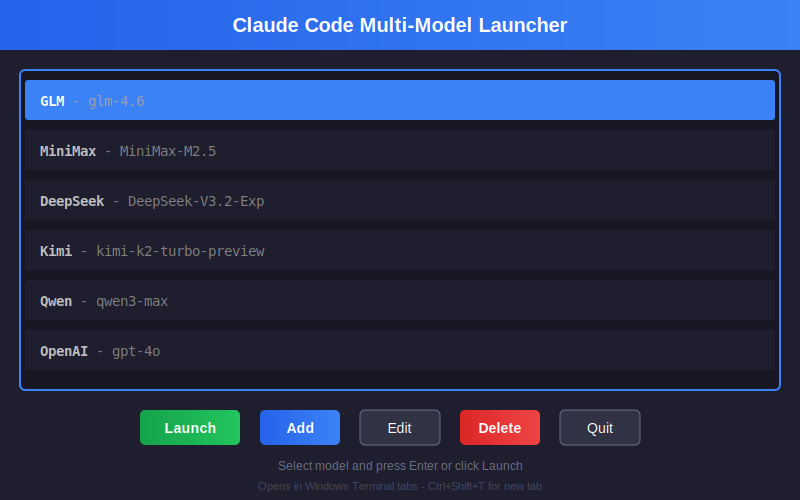
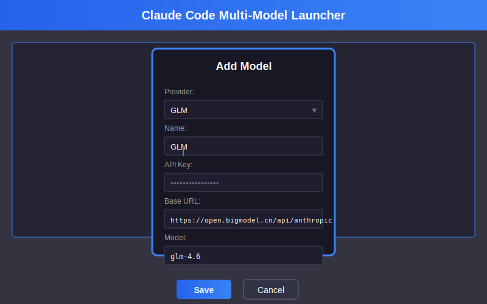

# Claude Code Multi-Model Launcher

A TUI-based launcher for Claude Code that supports multiple AI providers. Launch different AI models in Windows Terminal tabs with easy model switching.

一个基于 TUI 的 Claude Code 多模型启动器，支持多个 AI 供应商。在 Windows Terminal 标签页中启动不同的 AI 模型，轻松切换。

## Features / 功能特点

- **Multi-Model Support**: Configure and launch multiple AI models from a single interface
- **Windows Terminal Integration**: Each model runs in its own tab within Windows Terminal
- **Easy Configuration**: Add, edit, and delete model configurations through the TUI
- **Provider Templates**: Pre-configured templates for popular AI providers
- **Secure Storage**: API keys stored locally in configuration file

---

- **多模型支持**: 在单一界面配置和启动多个 AI 模型
- **Windows Terminal 集成**: 每个模型在 Windows Terminal 的独立标签页中运行
- **简单配置**: 通过 TUI 界面添加、编辑和删除模型配置
- **供应商模板**: 预配置主流 AI 供应商模板
- **安全存储**: API 密钥本地存储在配置文件中

## Supported Providers / 支持的供应商

| Provider | Base URL | Default Model |
|----------|----------|---------------|
| GLM (智谱) | open.bigmodel.cn | glm-4.6 |
| MiniMax | api.minimaxi.com | MiniMax-M2.5 |
| DeepSeek | api.deepseek.com | DeepSeek-V3.2-Exp |
| Kimi (月之暗面) | api.moonshot.cn | kimi-k2-turbo-preview |
| Qwen (通义千问) | dashscope.aliyuncs.com | qwen3-max |
| OpenAI | api.openai.com | gpt-4o |
| xAI Grok | api.x.ai | grok-4.1 |
| OpenRouter | openrouter.ai | claude-sonnet-4.5 |
| Custom | - | - |

## Requirements / 系统要求

- Windows 10/11
- Python 3.8+
- Windows Terminal (recommended) / PowerShell
- Claude Code CLI installed

## Installation / 安装

1. Clone the repository:
```bash
git clone https://github.com/your-username/claude-code-launcher.git
cd claude-code-launcher
```

2. Install dependencies:
```bash
pip install textual
```

3. Run the launcher:
```bash
python launcher.py
```

Or simply double-click `启动器.bat` on Windows.

---

1. 克隆仓库:
```bash
git clone https://github.com/your-username/claude-code-launcher.git
cd claude-code-launcher
```

2. 安装依赖:
```bash
pip install textual
```

3. 运行启动器:
```bash
python launcher.py
```

或者直接双击 `启动器.bat`。

## Usage / 使用方法

### Keyboard Shortcuts / 快捷键

| Key | Action | 操作 |
|-----|--------|------|
| `Enter` | Launch selected model | 启动选中模型 |
| `A` | Add new model | 添加新模型 |
| `E` | Edit selected model | 编辑选中模型 |
| `D` | Delete selected model | 删除选中模型 |
| `Q` | Quit application | 退出程序 |

### Adding a Model / 添加模型

1. Press `A` or click "Add" button
2. Select a provider from the dropdown (or choose "Custom")
3. Enter a name for your configuration
4. Enter your API key
5. Base URL and Model fields will auto-fill based on provider
6. Click "Save"

---

1. 按 `A` 或点击 "Add" 按钮
2. 从下拉菜单选择供应商（或选择 "Custom" 自定义）
3. 输入配置名称
4. 输入 API Key
5. Base URL 和 Model 会根据供应商自动填充
6. 点击 "Save" 保存

### Launching Claude Code / 启动 Claude Code

1. Select a model from the list using arrow keys
2. Press `Enter` or click "Launch"
3. Claude Code will open in a new Windows Terminal tab
4. Launch another model to open it in another tab

---

1. 使用方向键从列表中选择模型
2. 按 `Enter` 或点击 "Launch"
3. Claude Code 将在新的 Windows Terminal 标签页中打开
4. 启动另一个模型将在另一个标签页中打开

## Configuration / 配置

Model configurations are stored in `models.json` in the same directory as the launcher.

模型配置存储在启动器同目录下的 `models.json` 文件中。

```json
{
  "models": [
    {
      "name": "GLM",
      "provider": "GLM",
      "api_key": "your-api-key",
      "base_url": "https://open.bigmodel.cn/api/anthropic",
      "model": "glm-4.6"
    }
  ]
}
```

## How It Works / 工作原理

1. The launcher modifies `~/.claude/settings.json` temporarily to remove conflicting `env` settings
2. Sets environment variables (`ANTHROPIC_AUTH_TOKEN`, `ANTHROPIC_BASE_URL`, `ANTHROPIC_MODEL`)
3. Launches Claude Code in Windows Terminal
4. Restores original settings when Claude Code exits

---

1. 启动器临时修改 `~/.claude/settings.json`，移除冲突的 `env` 设置
2. 设置环境变量 (`ANTHROPIC_AUTH_TOKEN`, `ANTHROPIC_BASE_URL`, `ANTHROPIC_MODEL`)
3. 在 Windows Terminal 中启动 Claude Code
4. Claude Code 退出后恢复原始设置

## Screenshots / 截图

### Main Interface / 主界面


### Add Model Dialog / 添加模型对话框


## License / 许可证

MIT License

## Contributing / 贡献

Contributions are welcome! Please feel free to submit a Pull Request.

欢迎贡献！请随时提交 Pull Request。
